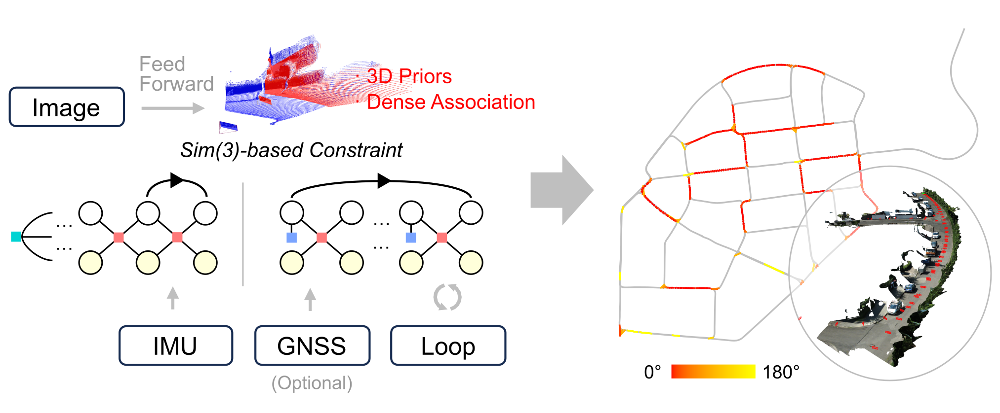
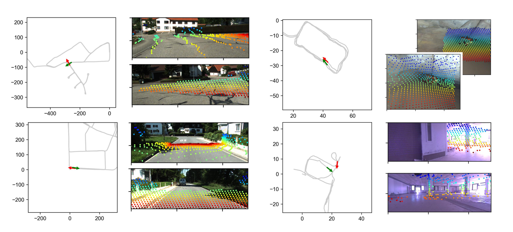
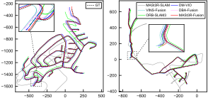
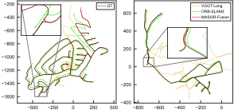
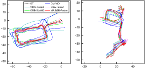
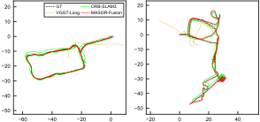
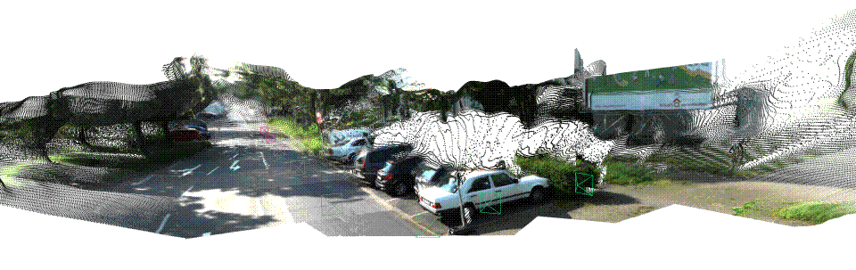
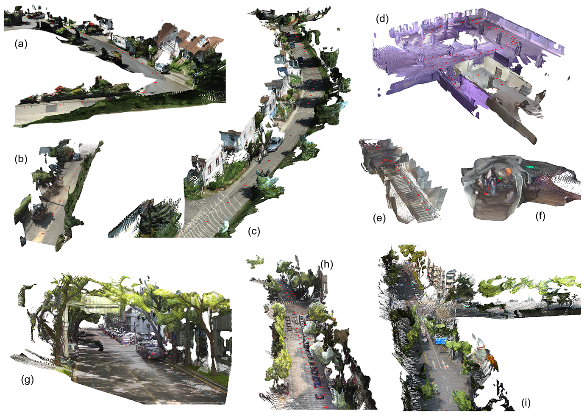

<h1 align="center">MASt3R-Fusion</h1>

<p align="center">
  <b>Integrating Feed-Forward Visual Model with IMU, GNSS for High-Functionality SLAM</b><br>
  <sub>
    Yuxuan Zhou, Xingxing Li, Shengyu Li, Zhuohao Yan, Chunxi Xia, Shaoquan Feng
  </sub>
</p>

<p align="center">
  <br>
  <em>  <sub>(The <b>heatmap</b> indicates the inter-frame angle of cross-temporal data association (loop closure).)</sub>
</em>
</p>

<p align="center">
  📄 <a href="https://arxiv.org/abs/2509.20757">Paper</a> |
  🎥 <em>Video (coming soon...)</em>
</p>

## What is this? 

MASt3R-Fusion is a SLAM system that tightly integrates feed-forward pointmap regression with multi-sensor data (e.g., IMU, GNSS), drawing inspiration from MASt3R-SLAM. It is designed for practical, large-scale 3D perception and mapping applications, and offers the following key features:

- ✅ High accuracy, high robustness, metric scale
- ✅ Full-view depth
- ✅ Multi-sensor fusion support
- ✅ Loop closure
- ✅ Real-time sliding-window tracking + globally consistent optimization
- ✅ Auto calibration  

The system is capable of handling arbitrarily long sequences based on <b>8 GB</b> GPU memory.

## Preview 

<div style="display: grid; grid-template-columns: 1fr 1fr; gap: 20px; justify-items: center;" align="center">
  
  
  
  
</div>

## Update
- [x] Code uploaded. 2025/10/28 
- [ ] Wuhan dataset (GNSS fuison example). ETA: 1~2 weeks
- [ ] Multi-thread pipeline.

## Installation

This system is built based on **PyTorch** and **GTSAM**.  The main logic and GPU-related processing are implemented using Python and CUDA,
while the factor graph is implemented using a modified version of GTSAM (C++ code and python interface).

### 🧩 Environment Setup

First, create a new **conda** environment and install the required dependencies:

```bash
conda create -n mast3r_fusion python=3.11.9
conda activate mast3r_fusion
pip install torch==2.5.1 torchvision==0.20.1 torchaudio==2.5.1 --index-url https://download.pytorch.org/whl/cu124
pip install opencv-python==4.10.0.84 opencv-contrib-python==4.10.0.84
pip install h5py pyparsing
```

---

### ⚙️ GTSAM Installation

Next, compile and install the **modified version of [GTSAM](https://github.com/yuxuanzhou97/gtsam)**,  
which includes additional functionalities such as **marginalization** and **Sim(3) visual constraints**.

```bash
conda activate mast3r_fusion
git clone https://github.com/yuxuanzhou97/gtsam.git
cd gtsam
mkdir build && cd build
cmake .. -DGTSAM_BUILD_PYTHON=1 -DGTSAM_PYTHON_VERSION=3.11.9 -DPYTHON_EXECUTABLE=`which python`
make python-install -j12
```

---

### 🚀 Project Installation

Then, clone and install this project:

```bash
git clone https://github.com/GREAT-WHU/MASt3R-Fusion.git --recursive
cd MASt3R-Fusion/
pip install -e thirdparty/mast3r
pip install -e thirdparty/in3d
pip install --no-build-isolation -e .
```

Setup the checkpoints for MASt3R and retrieval.  The license for the checkpoints and more information on the datasets used is written [here](https://github.com/naver/mast3r/blob/mast3r_sfm/CHECKPOINTS_NOTICE).
```
mkdir -p checkpoints/
wget https://download.europe.naverlabs.com/ComputerVision/MASt3R/MASt3R_ViTLarge_BaseDecoder_512_catmlpdpt_metric.pth -P checkpoints/
wget https://download.europe.naverlabs.com/ComputerVision/MASt3R/MASt3R_ViTLarge_BaseDecoder_512_catmlpdpt_metric_retrieval_trainingfree.pth -P checkpoints/
wget https://download.europe.naverlabs.com/ComputerVision/MASt3R/MASt3R_ViTLarge_BaseDecoder_512_catmlpdpt_metric_retrieval_codebook.pkl -P checkpoints/
```

## Run on KITTI-360 (V + I)

Download the [KITTI-360](https://www.cvlibs.net/datasets/kitti-360/index.php) datasets (we use ``Perspective Images for Train & Val (128G)'' for the evaluation). 
**To reproduce the results**, just download the our modified IMU  and ground-truth data (refer to [this](https://github.com/GREAT-WHU/DBA-Fusion?tab=readme-ov-file#2-kitti-360) for details) from here ([Google Drive](https://drive.google.com/file/d/1BO8zGvoey7IdwbWXmAdlhGPr6hiCFJ6Y/view?usp=drive_link), [Baidu Yun](https://pan.baidu.com/s/17MOZykbWzj9WlnVtXkSSsg?pwd=qmwq)), then uncompress it to the data path. 

**For quick start**, just refer to: 
```bash
bash batch_kitti360_vi.sh # for real-time SLAM
bash batch_kitti360_loop.sh # for global optimization
```

**Alternatively**, you can run the following commands step by step:

### Real-Time SLAM

The following command is used for real-time SLAM based on monocular images and IMU data:

```bash
python main.py \
        --dataset "${base_dataset_path}/2013_05_28_drive_0000_sync/image_00/data_rgb" \
        --config "config/base_kitti360.yaml" \
        --calib "config/intrinsics_kitti360.yaml" \
        --imu_path "${base_dataset_path}/2013_05_28_drive_0000_sync/imu.txt" \
        --imu_dt -0.04 \ # constant V-I time offset for KITTI-360  
        --stamp_path "${base_dataset_path}/2013_05_28_drive_0000_sync/camstamp.txt" \
        --result_path "result.txt" \
        --save_h5 \
        --no-viz # for realtime visualization, comment this line 
```
This would generate the following files:
- **result.txt**: Real-time pose estimation results.
- **graph.pkl**: Factor graph information, stored for later global optimization.
- **data.h5**: Keyframe information (faeture token, RGB, poses and so on), stored for visualization and later processing.

---


### Loop Closure

The following command is used for loop detection and cross-temporal data association:

```bash
python main_loop.py \
         --config "config/base_kitti360.yaml" \
         --h5_file "data.h5" \
         --loop_output "loop.pkl"
```

This would generate the following file:
- **loop.pkl**: Storing the loop closures (candidate pairs and relative transformation estimation).

---


### Global Optimization

The following command is used for global optmization based on the above results:

```bash
python main_global_optimization.py \
        --graph_path graph.pkl \
        --loop_path loop.pkl \
        --calib_path "config/intrinsics_kitti360.yaml" \
        --imu_path "${base_dataset_path}/2013_05_28_drive_0000_sync/imu.txt" \
        --imu_dt -0.04 \
        --result_path result_post.txt
```
This would generate the following file:
- **result_post.txt**: Global pose estimation results.

---


### Evaluation

For evaluation of the pose estimation results, run:
```bash
python evaluation/evaluate_kitti360.py
```

For visualization of the reconstruction results, run: 
```bash
python evaluation/check_h5.py --config config/base_kitti360.yaml \
         --h5 data.h5 \
         --calib config/intrinsics_kitti360.yaml # using real-time poses
python evaluation/check_h5.py --config config/base_kitti360.yaml \
         --h5 data.h5 \
         --calib config/intrinsics_kitti360.yaml \
         --pose_file result_post.txt # using globally optimized poses
```

## Run on SuBT-MRS (V + I)

Download the V-I sequences of Subt-MRS dataset [here](https://superodometry.com/iccv23_challenge_VI).

Similar to KITTI-360, just check the following scripts:
```bash
bash batch_subt_vi.sh # for real-time SLAM
bash batch_subt_loop.sh # for global SLAM
```
and
```bash
python evaluation/evaluate_subt.py # for evaluation of the pose estimation results;
python evaluation/check_h5.py # for visualization of the reconstruction results.
```

## Run on Wuhan Dataset (V + I + G)

Under construction, coming soon. (ETA: Nov 2025)

## Run on Your Own Data

If you want to run tests on your own custom data, please prepare the following:

- Image data (**\*.jpg, \*.png**) along with the corresponding timestamp file;
- IMU data (**timestamp, angular veocity (rad/s), acceletration (m/s2)**);
- Configuration file (**refer to config/base_XXX.yaml**)
- Camera intrinsic/extrinsic parameters (**refer to config/intrinsics_XXX.yaml**).

Once everything is ready, refer to the instructions above and give it a try!

(In current implementation, it is recommended to set the start point around the vehicle is about to move.)

## Results

<p align="center">
  <br>
<em>Fig. 1 Cross-temporal association (loop closure) enpowered by feed-forward model and verified by probabilistic optimization.<br>
 </em>
</p>

<p align="center">
  <br>
    <em>(a) w/o loop closure<br>
  <br>
      <em>(b) w/ loop closure<br>
<em>Fig. 2 Monocular V-I SLAM performance on KITTI-360.<br>
 </em>
</p>


<p align="center">
  <br>
    <em>(a) w/o loop closure<br>
  <br>
      <em>(b) w/ loop closure<br>
<em>Fig. 3 Monocular V-I SLAM performance on SubT-MRS.<br>
</p>


<p align="center">
  <br>
  <em>Fig. 4 Joint optimization of intrinsics and poses based on V-I data.</em>
</p>

<p align="center">
  <br>
  <em>Fig. 5 Some reconstruction results.</em>
</p>


## Acknowledgement
MASt3R-Fusion is developed by [GREAT](http://igmas.users.sgg.whu.edu.cn/group) (GNSS+ REsearch, Application and Teaching) Group, School of Geodesy and Geomatics, Wuhan University. 

<br/>
<div align=center>

</div>
<br/>
<div align=center>

</div>
<br/>

This work is based on [MASt3R-SLAM](https://github.com/princeton-vl/DROID-SLAM), [GTSAM](https://github.com/borglab/gtsam), [DBA-Fusion](https://github.com/GREAT-WHU/DBA-Fusion). We use evaluation tools from [evo](https://github.com/MichaelGrupp/evo).
