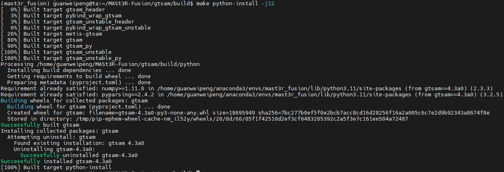

 <h1 align="center"> MASt3R-Fusion测试
  </h1>


[comment]: <> (  <h2 align="center">PAPER</h2>)
  <h3 align="center">
  <a href="https://github.com/GREAT-WHU/MASt3R-Fusion">Github</a>
  | <a href="https://arxiv.org/pdf/2509.20757">Paper</a>
  </h3>
  <div align="center"></div>

<br>

## 实验配置

* 环境配置

```bash
# rm -rf .git
git clone https://github.com/R-C-Group/MASt3R-Fusion-comment.git --recursive

conda create -n mast3r_fusion python=3.11.9
conda activate mast3r_fusion
# conda remove --name mast3r_fusion --all
pip install torch==2.5.1 torchvision==0.20.1 torchaudio==2.5.1 --index-url https://download.pytorch.org/whl/cu124
pip install opencv-python==4.10.0.84 opencv-contrib-python==4.10.0.84
pip install h5py pyparsing
```

* 安装GTSAM，这是作者修改版本的，包含了边缘化以及Sim(3)视觉约束

```bash
conda activate mast3r_fusion

# git clone https://github.com/yuxuanzhou97/gtsam.git
git clone git@github.com:yuxuanzhou97/gtsam.git
cd gtsam
# cd .. && rm -rf build/
mkdir build && cd build
cmake .. -DGTSAM_BUILD_PYTHON=1 -DGTSAM_PYTHON_VERSION=3.11.9 -DPYTHON_EXECUTABLE=`which python` -Dpybind11_INCLUDE_DIR=$PYBIND11_INCLUDE_DIR
make python-install -j12
```

* 可能会出现调用`/usr/include/pybind11/`等问题，需要安装最新版的pybind11，并精准CMake配置

```bash
pip install --upgrade pybind11

cd gtsam
rm -rf build

# 获取详细的 pybind11 信息
PYBIND11_INCLUDE_DIR=$(python -c "import pybind11; print(pybind11.get_include())")
PYBIND11_CMAKE_DIR=$(python -c "import pybind11; import os; print(os.path.join(pybind11.__path__[0], 'share', 'cmake', 'pybind11'))")

echo "Pybind11 include: $PYBIND11_INCLUDE_DIR"
echo "Pybind11 cmake: $PYBIND11_CMAKE_DIR"

mkdir build && cd build
cmake .. \
  -DGTSAM_BUILD_PYTHON=1 \
  -DGTSAM_PYTHON_VERSION=3.11.9 \
  -DPYTHON_EXECUTABLE=$(which python) \
  -Dpybind11_DIR=$PYBIND11_CMAKE_DIR \
  -DCMAKE_PREFIX_PATH=$CONDA_PREFIX \
  -DCMAKE_INCLUDE_PATH=$PYBIND11_INCLUDE_DIR

make python-install -j12
```

<div align="center">
  
<figcaption>  
</figcaption>
</div>

* 工程安装：

```bash
cd MASt3R-Fusion/
# pip install -e thirdparty/mast3r
pip install --no-build-isolation -e thirdparty/mast3r

pip install -e thirdparty/in3d
pip install --no-build-isolation -e .
```

* 对于`pip install --no-build-isolation -e .`涉及到lietorch的安装可能出现超时的问题，做出改进如下：

~~~
"lietorch @ git+https://github.com/princeton-vl/lietorch.git",
或者替换为：
"lietorch @ git+ssh://git@github.com/princeton-vl/lietorch.git",
~~~

* 下载权重文件

```bash
mkdir -p checkpoints/
wget https://download.europe.naverlabs.com/ComputerVision/MASt3R/MASt3R_ViTLarge_BaseDecoder_512_catmlpdpt_metric.pth -P checkpoints/
wget https://download.europe.naverlabs.com/ComputerVision/MASt3R/MASt3R_ViTLarge_BaseDecoder_512_catmlpdpt_metric_retrieval_trainingfree.pth -P checkpoints/
wget https://download.europe.naverlabs.com/ComputerVision/MASt3R/MASt3R_ViTLarge_BaseDecoder_512_catmlpdpt_metric_retrieval_codebook.pkl -P checkpoints/
```
